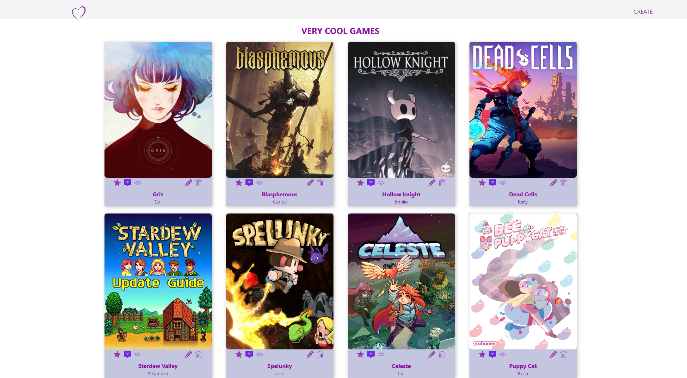

# My favorite games 🎮

A little exercise to practice react. \
This project shows my favorite games using a fake api 🔮 \
Also this project helps us to practice the frontend using SASS.

## Project setup 📌

```
git clone https://github.com/SolTuripe/react-app-favorite-games.git
cd react-app-favorite-games
npm install
```

## In the project directory, you can run:

`npm start`

Runs the app in the development mode.\
Open [http://localhost:3000](http://localhost:3000) to view it in the browser.

The page will reload if you make edits.\
You will also see any lint errors in the console.

## Page view 📷

<p align="center">

</p>

## Learn More 📚

You can learn more in the [Create React App documentation](https://facebook.github.io/create-react-app/docs/getting-started).

To learn React, check out the [React documentation](https://reactjs.org/).
